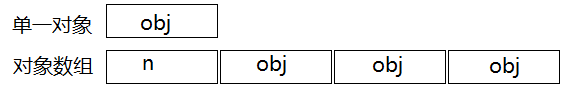

# 3. 资源管理

最常用的资源：动态分配的内存、文件描述器、互斥锁、数据库连接、sockets。

## 13 以对象管理资源

考虑如下：

```
void f(){
	Invesment* pInv = createInvesment();		// 调用factory函数
	...
	delete pInv;								// 释放pInv所指对象
}
```

有些情况可能不会释放资源：`...`处如果有return语句，goto语句，或是抛出异常，则delete就不会执行，也就不会释放该资源。

为确保`createInvesment`返回资源总是释放，需要将资源放进对象内，在离开区块或函数时，对象的析构函数会自动释放该资源。**该思想就是：依赖于C++的析构函数自动调用确保资源被释放**。

**auto_ptr**：析构函数自动对所指对象调用delete。即auto_ptr对象离开作用域时被销毁，会自动删除所指对象。

auto_ptr性质：通过copy构造函数或copy assignment操作符复制，本身会变成null，则复制得到的指针将会将获得资源的拥有权。

**注意**：不要让多个auto_ptr指向同一个对象，否则一个删除，其他就会出现未定义行为。

**shared_ptr**：由于auto_ptr的上述弊端，则引入shared_ptr，该保留一个计数指针，用来记录有多少对象同时指向同一资源


### 总结

管理资源尽可能使用shared_ptr，它们在构造函数中获得资源，而在析构函数中释放资源。


## 14 资源管理类中小心copying行为

auto_ptr和shared_ptr，适合管理heap-based类型的资源，而不属于这类型的资源，它们并不合适作为资源管理者。

比如某时候，离开函数自动释放资源时不需要删除资源而是其他动作：

```
class Lock{
public:
	explicit Lock(Mutex *em): mutexPtr(em){
		lock(mutexPtr);
	}
	
	~Lock(){
		unLock(mutexPtr);			// 释放资源时解锁，而非删除
	}
private:
	Mutex *mutexPtr;
}
```

使用：

```
Mutex me;           // 定义互斥量
...
...
{                   // 进入某些临界区
	Lock m1(&me);   // 获得锁
	...
}                   // 离开作用域，自动解除互斥量锁定
```

这些资源就应该被禁止copying行为，如果有奇怪的操作：

```
Lock m1(&me);		// 锁定me
Lock m2(m1);		// 如果对这类资源复制，会发生什么
```

解决：

1. 禁止复制：如条款6一样，copying函数声明为private。
2. 使用“引用计数”资源管理，shared_ptr，但是这种方式管理，**引用为0时会删除资源，需要为其指定我们想要的释放动作**：

```
class Lock{
public:
	explicit Lock(Mutex *em): mutexPtr(em, unlock){		// 初始化shared_ptr
		lock(mutexPtr.get());							// 指定“删除器”为unlock
	}
	...
private:
	std::shared_ptr<Mutex> mutexPtr;					// 使用shared_ptr替换raw pointer
}
```

**注意**：此时也不再自己声明析构函数，其调用默认即可，且mutexPtr的析构函数在引用数为0时调用shared_ptr的**删除器**。

3. 复制底层资源，深拷贝
4. 转移底层资源，auto_ptr


### 总结

复制RAII对象（auto_ptr, shared_ptr或类似机制的资源管理对象）必须一并复制它所管理的资源。

常见的RAII copying行为：抑制，引用计数。


## 15 在资源管理类中提供对原始资源的访问

有时候需要获取资源管理对象的原始指针，有几个方式可以实现：

### 显示转换：

shared_ptr和auto_ptr都提供了get()方法，返回智能指针内部的原始指针（的副本）

### 隐式转换：

shared_ptr和auto_ptr也重载了指针取值操作符（operator->和operator*），隐式转换为底部原始指针

### 通过转换函数：

考虑一个资源管理对象Font类：

```
FontHandle getFont();
void releaseFont(FontHandle);

class Font{										// RAII对象
public:
	explicit Font(FontHandle fh): f(fh) { }		// 获取资源，pass-by-value方式
	~Font() { releaseFont(f); }					// 释放资源
private:
	FontHandle f;								// 原始RAW对象
}
```

要获取Font中FontHandle资源，提供一个get()函数：

```
class Font{										// RAII对象
public:
	...
	FontHandle get() const { return f; }		// 显示转换函数
	...
}
```

但是每次得调用get函数，不够自然

或者：

```
class Font{										// RAII对象
public:
	...
	operator FontHandle() const { return f; }		// 隐式转换函数
	...
}
```

这种隐式转换函数使用更加自然：

```
Font f(getFont());
int newFontSize;
...
changeFontSize(f, newFontSize);					// 将Font隐式转换为FontHandle
```

但是又有风险：

```
Font f1(getFont());
...
FontHandle f2 = f1;					// 原意是想拷贝Font对象，却复制了底层的资源FontHandle
```

此时f1被销毁，f2就是“虚吊的”。


### 总结

RAII对象应该提供一些获取底层资源对象的方式，以给某些API使用。

对底层资源访问可能经过显示或隐式转换。一般显示比较安全，隐式对更方便使用，但也存在一定风险。


## 16 成对使用new和delete时采用相同形式

使用new时发生两件事：

1. 内存被分配，通过名为operator new的函数，见条款49和51。
2. 针对此内存会有一个（或多个）**构造函数**被调用。

即使在函数内部，**new出来的对象放在堆中**，如果未delete，离开了函数作用域，数据依然存在堆中，导致内存泄漏问题。

使用delete时也发生两件事：

1. 针对此内存会有一个（或多个）**析构函数**被调用。
2. 内存被释放，通过名为operator delete的函数。

delete的最大问题：被删除的内存中有多少对象，决定了有多少个析构函数被调用。即：被删除的指针，指的是单一对象还是对象数组。

通常数组的内存布局不同于单一对象，因为数组的内存还包括数组大小的记录，以便delete知道需要调用多少析构函数。



所以使用delete时，必须要告诉它，指定删除的内存时单一对象还是对象数组，需要加上中括号`[]`区分

```
string* stringPtr1 = new string;
string* stringPtr2 = new string[100];
...
delete stringPtr1;
delete[] stringPtr2;
```

使用typedef定义数组时，也应非常小心：

```
typedef string AddressLines[4];
string* pal = new AddressLines;			// new AddressLines返回一个string*，就像new string[4]一样
```

此时删除pal也必须使用delete []形式

```
delete [] pal;
```


## 17 以单独的语句将new创建的对象放入智能指针

因为C++对函数参数的执行次序不能保证：

```
int priority();												// 获取优先级
processWidget(shared_ptr<Widget>(new Widget), priority());	// 对动态分配的Widget进行优先级处理
```

但是第二条语句调用之前，需要完成三件事，但是C++对其顺序不能保证：

1. 一种情况
   1. 调用priority
   2. 执行`new Widget`
   3. 调用shared_ptr构造函数
2. 第二种情况
   1. 执行`new Widget`
   2. 调用priority
   3. 调用shared_ptr构造函数

所以为了防止异常情况（如priority调用异常），导致`new Widget`的指针遗失，故最好如下做：

```
shared_ptr<Widget> pw(new Widget);        // 正确的做法
processWidget(pw, priority());
```

即在**单独的语句中存储new出来的对象**，不要将这个动作放到函数参数位置。

